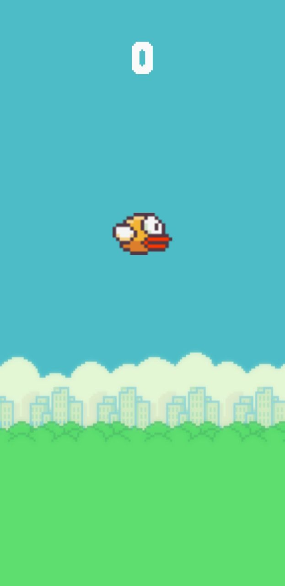
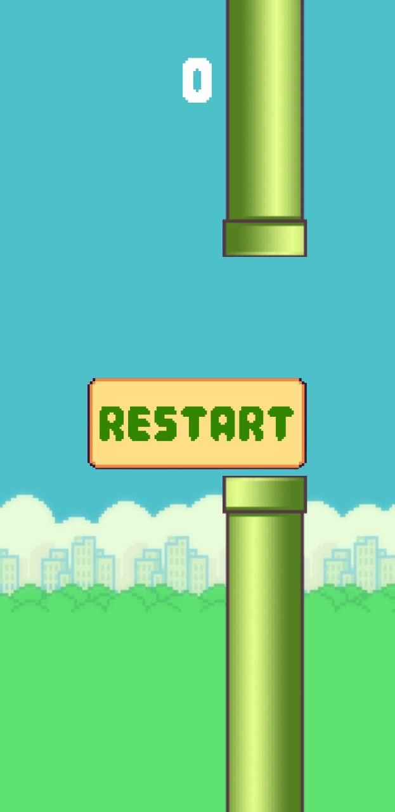

# Flappy Bird 2D

A Unity-powered 2D game where players navigate a bird through gaps between pipes.

## Features

- **Simple Controls**: Tap to make the bird flap its wings.
- **Endless Gameplay**: Survive as long as possible to achieve high scores.
- **Dynamic Obstacles**: Pipes with varying gaps and positions.

## Installation

1. **Clone the Repository**:

   ```bash
   git clone https://github.com/vosidovmsaid2007/Flappy-Bird-2D.git

2. **Open in Unity**:

   - Launch Unity Hub.
   - Click on the "Add" button and select the cloned repository folder.
   - Open the project in Unity Editor.

3. **Play the Game**:

   - In the Unity Editor, press the "Play" button to start the game.

## Images from Game
<p align="center">
  
  
</p>

## License

This project is licensed under the MIT License. See the [LICENSE](LICENSE) file for details.

## Acknowledgments

- Developed by Vosidov Muhammadsaid.
- Special thanks to the Unity community for their support and resources.

---

Feel free to share your feedback or ideas to improve the game. Happy gaming!
